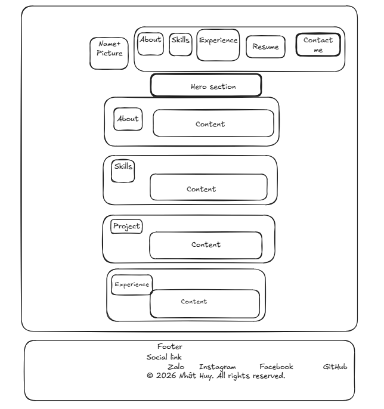
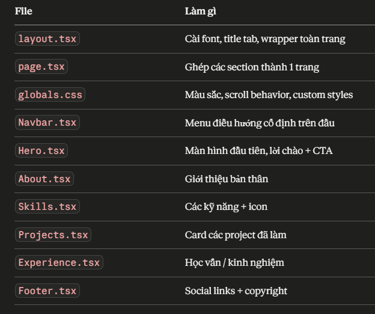

- Cấu trúc file:
```
app/
  page.tsx        ← trang chính
  globals.css     ← custom styles
components/
  Navbar.tsx
  Hero.tsx
  About.tsx
  Skills.tsx
  Projects.tsx
  Experience.tsx
  Footer.tsx
```
- Cấu trúc thư mục:
```
my-portfolio/
├── app/
│   ├── layout.tsx        ← khung chung (font, metadata)
│   ├── page.tsx          ← ghép tất cả sections lại
│   └── globals.css       ← CSS toàn cục
│
├── components/
│   ├── Navbar.tsx
│   ├── Hero.tsx
│   ├── About.tsx
│   ├── Skills.tsx
│   ├── Projects.tsx
│   ├── Experience.tsx
│   └── Footer.tsx
│
└── public/
    ├── avatar.png        ← ảnh của bạn
    └── resume.pdf        ← CV của bạn
```
- Luồng hoạt động:
```
layout.tsx
  └── page.tsx
        ├── <Navbar />
        ├── <Hero />
        ├── <About />
        ├── <Skills />
        ├── <Projects />
        ├── <Experience />
        └── <Footer />
```
- Vai trò từng file:

